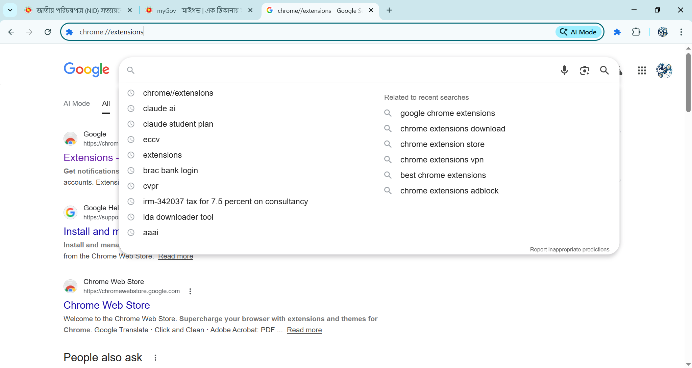
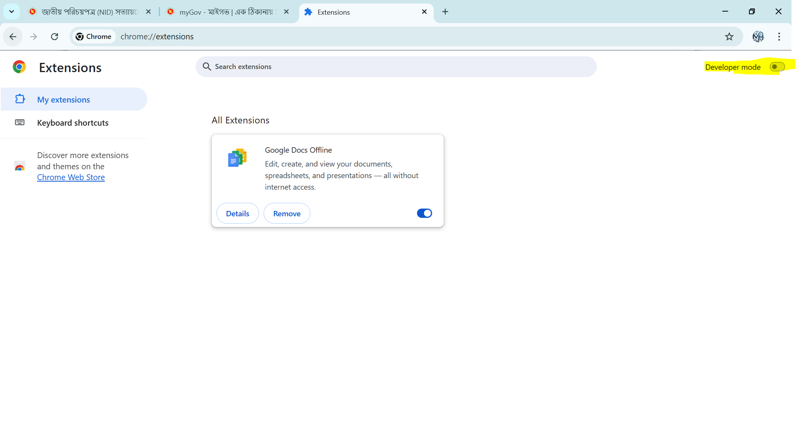
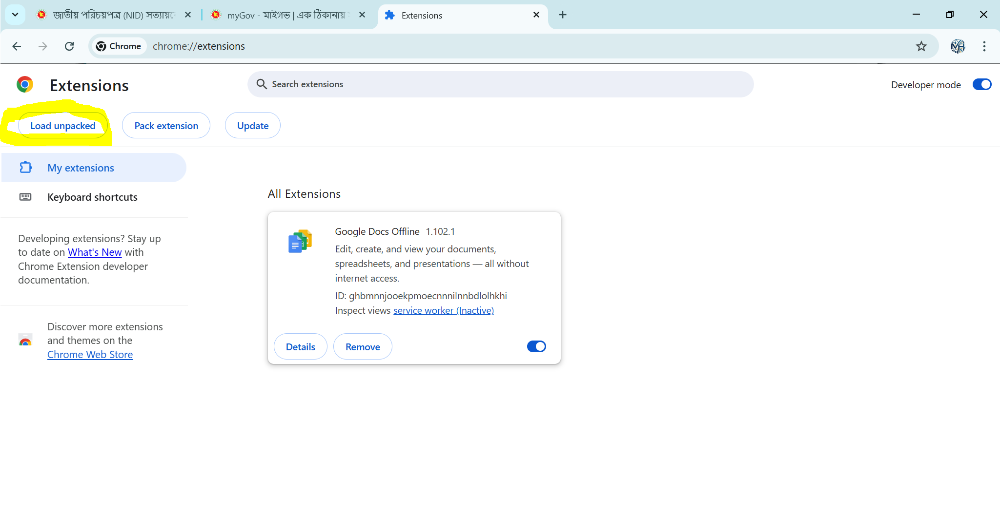
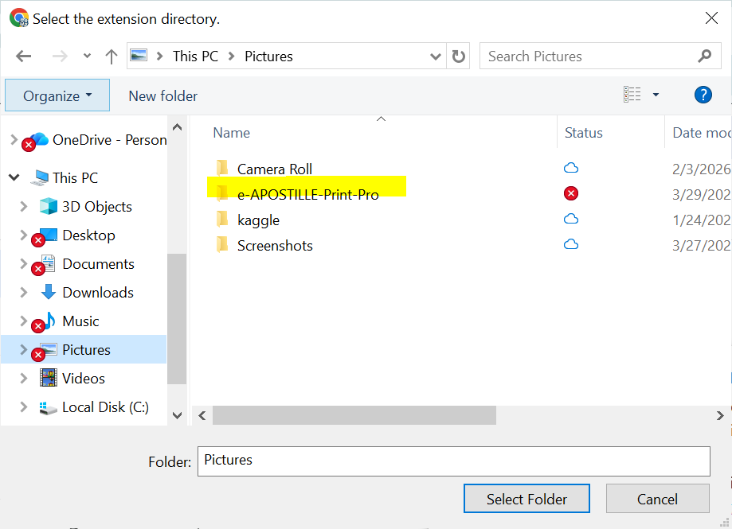
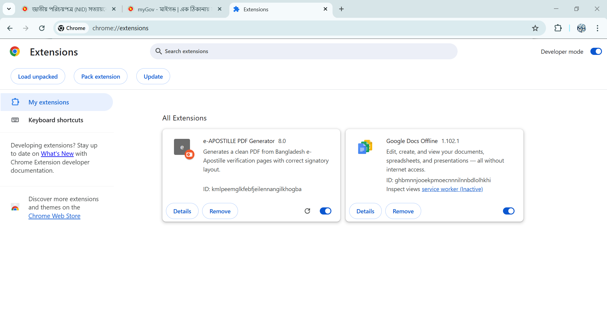
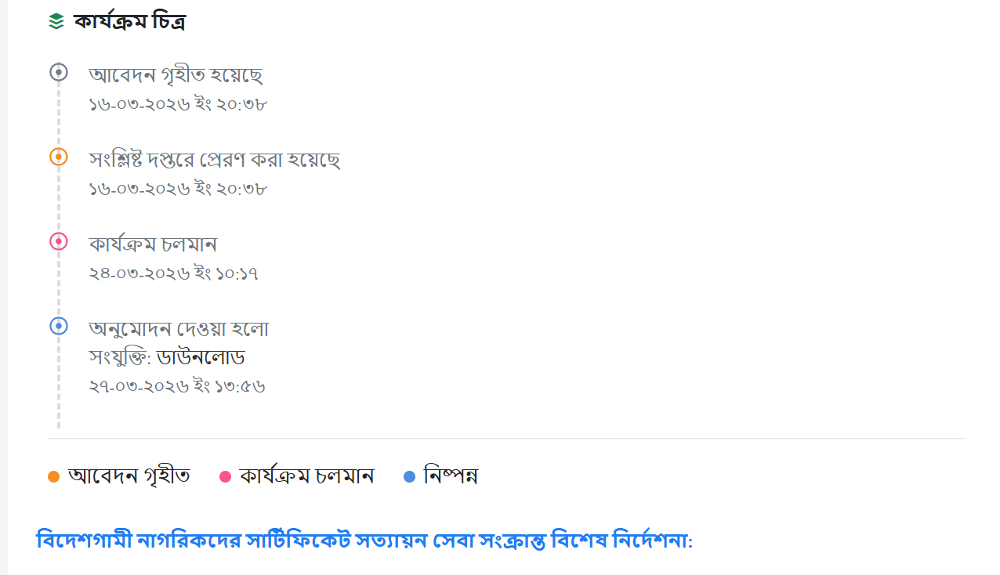
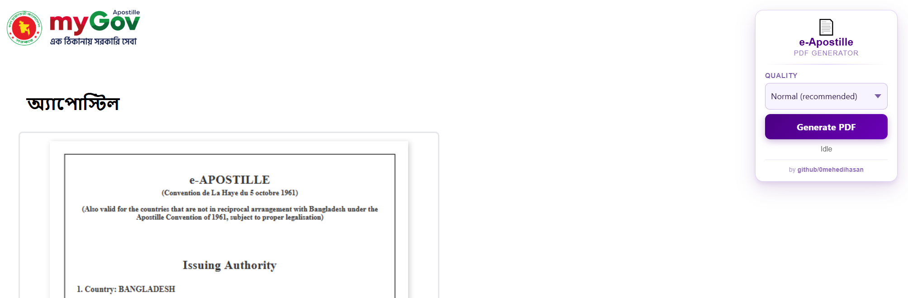
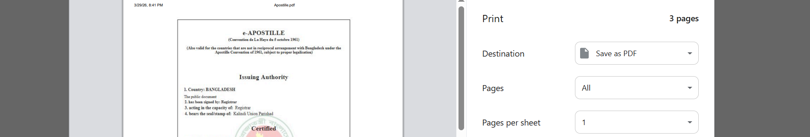

# e-Apostille Print (Bangladesh)

A Chrome extension that improves print output from the Bangladesh e-Apostille portal and helps generate clean, print-ready PDFs.

## Overview

The extension package in `e-APOSTILLE-Print-Pro` injects a small control panel into `https://apostille.mygov.bd/*`, then:

- collects the certificate canvas and document images,
- extracts and arranges signatory details,
- applies print-friendly A4 styling,
- opens the browser print dialog for PDF save/print.

## Features

- Clean A4 print layout tuned for apostille documents
- Signature block parsing and structured placement (3 columns per row)
- Certificate + attached document extraction
- Compression modes:
  - Normal (recommended)
  - Small file
  - Very small file
- Auto filename generation from apostille/certificate number
- Simple in-page UI (quality selector + progress status)

## Repository Structure

- `e-APOSTILLE-Print-Pro/manifest.json` — Chrome extension manifest (MV3)
- `e-APOSTILLE-Print-Pro/content.js` — content script logic and PDF/print flow
- `e-APOSTILLE-Print-Pro/styles.css` — injected panel styles
- `install_figs/` — installation screenshots

## Manual Installation (Step by Step)

> Prerequisite: Download or clone this repository locally.

1. Open Chrome extensions page: `chrome://extensions/`

   

2. Turn on **Developer mode**

   

3. Click **Load unpacked**

   

4. Choose the extension folder: `e-APOSTILLE-Print-Pro`

   

5. Confirm the extension appears in your extensions list

   

## Usage (Step by Step)

1. Open your e-Apostille page and click the extension panel button **Generate PDF**

   

2. Wait for processing, then continue when the preview/print flow is ready

   

3. Save as PDF or print from the browser print dialog

   

## Troubleshooting

- **Popup blocked**: allow popups for `apostille.mygov.bd` and retry.
- **Nothing exported**: make sure the target page has fully loaded (images/canvas visible).
- **Wrong page**: this extension is designed specifically for `https://apostille.mygov.bd/*`.

## Open Source

Contributions are welcome.

- Open an issue for bugs, ideas, or questions.
- Submit a pull request with clear change scope and testing notes.
- Keep changes focused and aligned with existing project style.

## License

This project is licensed under the [MIT License](LICENSE).
